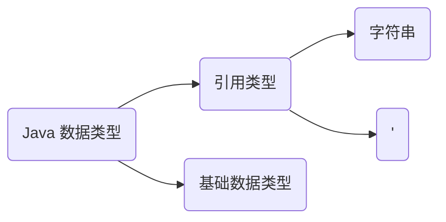

# Java 基础

## .Java 源文件

```powershell
// 编译源文件
javac *.java

// 运行字节码文件
java *.class
```

> 一个文件中可以有多个 class，但只能有一个 class 声明为 public，并且需要跟文件名同名
> .class 字节码文件（编译后产生）与 class 类名相同

## Java 关键字

关键字一律用小写字母标识，按其用途划分为如下几组。

### 数据类型

用于数据类型的关键字有 boolean、byte、char、 double、 false、float、int、long、new、short、true、void、instanceof。



### 语句

用于语句的关键字有 break、case、 catch、 continue、 default 、do、 else、 for、 if、return、switch、try、 while、 finally、 throw、this、 super。

### 修饰符

-   abstract
-   final
-   native
-   private
-   protected
-   public
-   static
-   synchronized
-   transient
-   volatile

### 方法、类、接口、包、异常

-   class
-   extends
-   implements
-   interface
-   package
-   import
-   throws

### 无意义

-   cat
-   future
-   generic
-   innerr
-   operator
-   outer
-   rest
-   var

### 特殊值

true、false、null

## package 管理

    一个 Something.java 文件它的内容，文件名与 public 修饰的类名相同

```
package net.java.util;
public class Something{
   ...
}
```

那么它的路径应该是 net/java/util/Something.java 这样保存的。 package(包) 的作用是把不同的 java 程序分类保存，更方便的被其他 java 程序调用。

# 内置数据类型

## 基本数据类型

Java 语言提供了八种基本类型。六种数字类型（四个整数型，两个浮点型），一种字符类型，还有一种布尔型。

### 数字

所有的包装类**（Integer、Long、Byte、Double、Float、Short）**都是抽象类 Number 的子类

#### 整型

##### byte

```java
// byte 数据类型是8位、有符号的，以二进制补码表示的整数；
// 最小值是 -128（-2^7）；
// 最大值是 127（2^7-1）；
// 默认值是 0；
// byte 类型用在大型数组中节约空间，主要代替整数，因为 byte 变量占用的空间只有 int 类型的四分之一；
// 例子：
byte a = 100，byte b = -50。
```

##### short

```java
// short 数据类型是 16 位、有符号的以二进制补码表示的整数
// 最小值是 -32768（-2^15）；
// 最大值是 32767（2^15 - 1）；
// Short 数据类型也可以像 byte 那样节省空间。一个short变量是int型变量所占空间的二分之一；
// 默认值是 0；
// 例子：
short s = 1000，short r = -20000。
```

##### int

```java
// int 数据类型是32位、有符号的以二进制补码表示的整数；
// 最小值是 -2,147,483,648（-2^31）；
// 最大值是 2,147,483,647（2^31 - 1）；
// 一般地整型变量默认为 int 类型；
// 默认值是 0 ；
例子：
int a = 100000, int b = -200000。
```

##### long

```java
// long 数据类型是 64 位、有符号的以二进制补码表示的整数；
// 最小值是 -9,223,372,036,854,775,808（-2^63）；
// 最大值是 9,223,372,036,854,775,807（2^63 -1）；
// 这种类型主要使用在需要比较大整数的系统上；
// "L"理论上不分大小写，但是若写成"l"容易与数字"1"混淆，不容易分辩。所以最好大写。
// 默认值是 0L；
long a = 100000L，Long b = -200000L。
```

> 习惯在 `long` 型的变量后边加上`L`，否则会认为是`int`类型
>
> 编译提示：过大的整数

> 以上四种都是有符号，以二进制补码表示的整数，下面是浮点数
>
> **整型常量默认是`int`型**

#### 浮点型

##### float

```java
// float 数据类型是单精度、32位、符合IEEE 754标准的浮点数；
// float 在储存大型浮点数组的时候可节省内存空间；
// 默认值是 0.0f；
// 浮点数不能用来表示精确的值，如货币；
// 例子：
float f1 = 234.5f。
```

> `float`型数据定义的时候必须在后边加上`f`
>
> 编译提示：编译失败

##### double

```java
// double 数据类型是双精度、64 位、符合IEEE 754标准的浮点数；
// 浮点数的默认类型为double类型；
// double类型同样不能表示精确的值，如货币；
// 默认值是 0.0d；
// 例子：
double d1 = 123.4。
```

> 通常定义整型变量时用 `int`
>
> **浮点型常量默认为`double`型**

#### 布尔型

```java
boolean one = true //
boolean two = false //
```

#### 字符型

```java
char (1字符 = 2字节 = 16 bit);
char c1 = 'a'; // √
char c2 = 'ab'; // ×
char c3 = '' // × 不能为空，空白字符不为空
char c4 = 'a' // a 对应的ASCII码值是97
char c5 = 'A' // A 对应的ASCII码值是65
```

> char 类型只能是一个字符，对于多个字符的情况，使用字符串
>
> **单独的字母都可视为数字，值对应的是`ASCII`码值**

## 引用数据类型

### Class （类）

### 接口

### 数组

### String

-   声明一个字符串

```java
String name = "Tom" // 双引号
```

> String 可以和 8 种数据类型做运算，并且只能是连接运算，运算结果都是 `String` 类型

# 数据类型转换

## 自动类型转换

```text
低  ------------------------------------>  高
byte,short,char —> int —> long—> float —> double
必须满足 转换前的数据类型的位数 要低于转换后的数据类型
```

-   自动数据类型转换遵顼的规则

> 不能对 boolean 类型进行类型转换。
>
> 不能把对象类型转换成不相关类的对象。
>
> 在把容量大的类型转换为容量小的类型时必须使用强制类型转换。
>
> 转换过程中可能导致溢出或损失精度，
>
> 浮点数到整数的转换是通过舍弃小数得到，而不是四舍五入

## 强制类型转换

> 需要使用强转符号 `()`
>
> 可能导致精度损失

```java
double a = 1.6;
int b = (int)a; // 截断操作

long c = 123;
short d = (short)c; // 没有精度损失

int e = 128;
byte f = (byte)e; // 精度损失
```

# Java 修饰符

### 访问控制修饰符

-   **default** (即默认，什么也不写）: 在同一包内可见，不使用任何修饰符。使用对象：类、接口、变量、方法。
-   **private** : 在同一类内可见。使用对象：变量、方法。 **注意：不能修饰类（外部类）**
-   **public** : 对所有类可见。使用对象：类、接口、变量、方法
-   **protected** : 对同一包内的类和所有子类可见。使用对象：变量、方法。 **注意：不能修饰类（外部类）**。

```java
public class selfAddMinus{
    public static void main(String[] args){
        int a = 5;//定义一个变量；
        int b = 5;
        int x = 2*++a;
        int y = 2*b++;
        System.out.println("自增运算符前缀运算后a="+a+",x="+x);
        System.out.println("自增运算符后缀运算后b="+b+",y="+y);
    }
}
```

运行结果为

> 自增运算符前缀运算后 a=6，x=12
> 自增运算符后缀运算后 b=6，y=10

-   短路逻辑运算符

> 当使用与逻辑运算符时，在两个操作数都为 true 时，结果才为 true，

# 循环语句

-   Java 增强 for 循环

```java
public class Test {
   public static void main(String args[]){
      int [] numbers = {10, 20, 30, 40, 50};

// 声明新的局部变量，该变量的类型必须和数组元素的类型匹配。其作用域限定在循环语句块，其值与此时数组元素的值相等。
// 表达式：表达式是要访问的数组名，或者是返回值为数组的方法。
      for(int x : numbers ){
         System.out.print( x );
         System.out.print(",");
      }

      System.out.print("\n");
      String [] names ={"James", "Larry", "Tom", "Lacy"};
      for( String name : names ) {
         System.out.print( name );
         System.out.print(",");
      }
   }
}
```

-   continue 语句

> continue 适用于任何循环控制结构中。作用是让程序立刻跳转到下一次循环的迭代。
>
> 在 for 循环中，continue 语句使程序立即跳转到更新语句。
>
> 在 while 或者 do…while 循环中，程序立即跳转到布尔表达式的判断语句。

```java
public class Test {
   public static void main(String args[]) {
      int [] numbers = {10, 20, 30, 40, 50};

      for(int x : numbers ) {
         if( x == 30 ) {
        continue;
         }
         System.out.print( x );
         System.out.print("\n");
      }
   }
}
```

以上实例编译运行结果如下：

> 10
> 20
> 40
> 50

-   switch-case 语句
    如果 case 语句块中没有 break 语句时，JVM 并不会顺序输出每一个 case 对应的返回值，而是继续匹配，匹配不成功则返回默认 case。

```java
public class Test {
   public static void main(String args[]){
      int i = 5;
      switch(i){
         case 0:
            System.out.println("0");
         case 1:
            System.out.println("1");
         case 2:
            System.out.println("2");
         default:
            System.out.println("default");
      }
   }
}
```

以上结果输出为

> default
> 匹配不到 break 继续执行后续的 case，直到匹配到为止

# Java String 类

-   String

    <font color="red">String 类是不可改变的，所以你一旦创建了 String 对象，那它的值就无法改变了</font>

    String 创建的字符串存储在公共池中，而 new 创建的字符串对象在堆上

```java
String s1 = "Runoob";              // String 直接创建
String s2 = "Runoob";              // String 直接创建
String s3 = s1;                    // 相同引用
String s4 = new String("Runoob");   // String 对象创建
String s5 = new String("Runoob");   // String 对象创建
```

# Java StringBuffer 与 java StringBuilder 类

```java
StringBuffer sBuffer = new StringBuffer("Hello");
StringBuilder sBuilder = new StringBuilder(10);
```

> StringBuffer、StringBuilder 如需要对字符串进行修改，则使用他们，每次修改不会产生新的变量
>
> StringBuilder 类在 Java 5 中被提出，它和 StringBuffer 之间的最大不同在于 **`StringBuilder 的方法不是线程安全的（不能同步访问）`**

> 由于 StringBuilder 相较于 StringBuffer 有速度优势，所以多数情况下建议使用 StringBuilder 类。
>
> **然而在应用程序要求线程安全的情况下，则必须使用 StringBuffer 类。**

# Java 数组

> 数组为引用类型的数据

## 一维数组

声明一个浮点数类型的数组变量

```java
double[] myList; // 首选的方法
double myList[]; // 效果相同，但不是首选方法
```

## 多维数组

### 多维数组的动态初始化（以二维数组为例）

```java
type[][] typeName = new type[typeLength1][typelength2];
```

> type 可以为基本数据类型和复合数据类型，typeLength1 和 typeLength2 必须为正整数，typeLength1 为行数，typeLength2 为列数。
>
> 例如：
>
> ```java
> int a[][] = new int[2][3];
> ```
>
> 解析为：二维数组 a 可以看成一个两行三列的数组。

# Java Date()

## 构造函数

```java
Date();
```

```java
Date(long millisec)
```

获取当前时间

```java
import java.util.Date;

public class DateDemo {
   public static void main(String args[]) {
       // 初始化 Date 对象
       Date date = new Date();
       // 使用 toString() 函数显示日期时间
       System.out.println(date.toString());
   }
}
```

## 日期比较

```java
before()
after()
equals()
```

```java
new Date(99, 2, 12).before(new Date (99, 2, 18))
```

# Java 方法

## 方法的定义

```text
修饰符 返回值类型 方法名(参数类型 参数名){
    ...
    方法体
    ...
    return 返回值;
}
```

eg:

```java
public static int max(int num1, int num2) {
  return num1 > num2 ? num1 : num2;
}
```

> 当函数不返回值的时候，返回值类型应当是 **`void`**

## 方法的调用

### 有返回值

被当作一个具体的值来使用

```java
int larger = max(30, 40);
```

### 无返回值

使用表达式调用

```java
System.out.println("hello");
```

**Java [异常处理]()**
